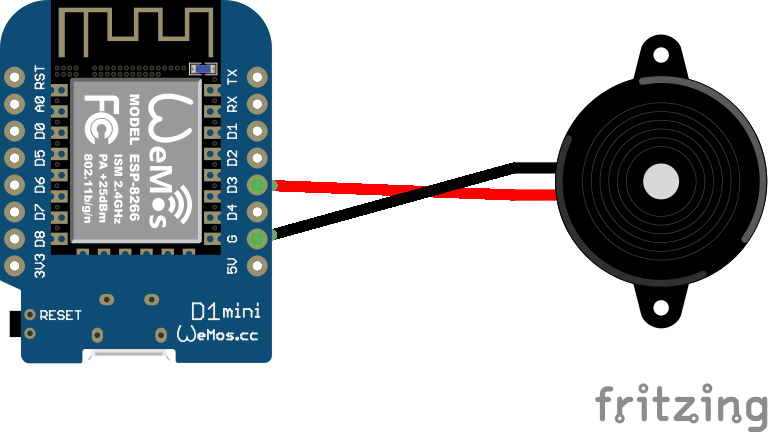
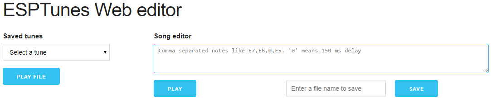

# ESPTunes - A Micro Python based offline web editore for WeMos D1 Mini to play music using buzzer

For a complete guide and demo, visit this video: 

## Schematic

</img>

## Setup

Make sure you are using Python 2.7.x

```
$ python -V
$ Python 2.7.12
```

Head to [https://micropython.org/download](https://micropython.org/download) and download latest version of Micro python firmaware from **Firmware for ESP8266 boards** section. At the time of writing this, it is 1.10

Install esptool to burn the firmware onto WeMos D1 `$ pip install esptool`

Change into the folder where the firmware _.bin_ file is downloaded and execute the following command

**Windows**
```
$ esptool.py --port COM3 --baud 115200 write_flash --flash_size=detect 0 esp8266-20190125-v1.10.bin
```

**Mac/Linux**
```
$ esptool.py --port /dev/ttyUSB0 --baud 115200 write_flash --flash_size=detect 0 esp8266-20190125-v1.10.bin
```

Install ampy tool from Adafruit to push code from this repo to ESP8266

```
$ pip install adafruit-ampy
$ ampy
Usage: ampy [OPTIONS] COMMAND [ARGS]...

  ampy - Adafruit MicroPython Tool

  Ampy is a tool to control MicroPython boards over a serial connection.
  Using ampy you can manipulate files on the board's internal filesystem
  and even run scripts.

Options:
  -p, --port PORT    Name of serial port for connected board.  Can optionally
                     specify with AMPY_PORT environment variable.  [required]
  -b, --baud BAUD    Baud rate for the serial connection (default 115200).
                     Can optionally specify with AMPY_BAUD environment
                     variable.
  -d, --delay DELAY  Delay in seconds before entering RAW MODE (default 0).
                     Can optionally specify with AMPY_DELAY environment
                     variable.
  --version          Show the version and exit.
  --help             Show this message and exit.

Commands:
  get    Retrieve a file from the board.
  ls     List contents of a directory on the board.
  mkdir  Create a directory on the board.
  put    Put a file or folder and its contents on the board.
  reset  Perform soft reset/reboot of the board.
  rm     Remove a file from the board.
  rmdir  Forcefully remove a folder and all its children from the board.
  run    Run a script and print its output.
$ _
```

Clone this repo and change into the directory. Push the code into WeMos board using ampy's put command

```
$ ampy -p COM3 put esptuneswebserver.py
$ ampy -p COM3 esptunes.html
$ ampy -p COM3 tonesDict.json
$ ampy -p COM3 main.py
```

Reboot the board connect to board in station mode. You should see a WiFi access point like MicroPython-adaXXX. Use the password "micropythoN" to connect to it. Go to your favourite browser type http://192.168.4.1/. If everything goes well, you should welcomed with a screen like this below.

</img>

## Plans for future release

* Ability to delete selected files
* Ability to edit and save file
* Warning if user tries to overwrite an existing file
* Integrate with ssd1306 oled module

Please suggest if you can think of a cool addition to the tool!
